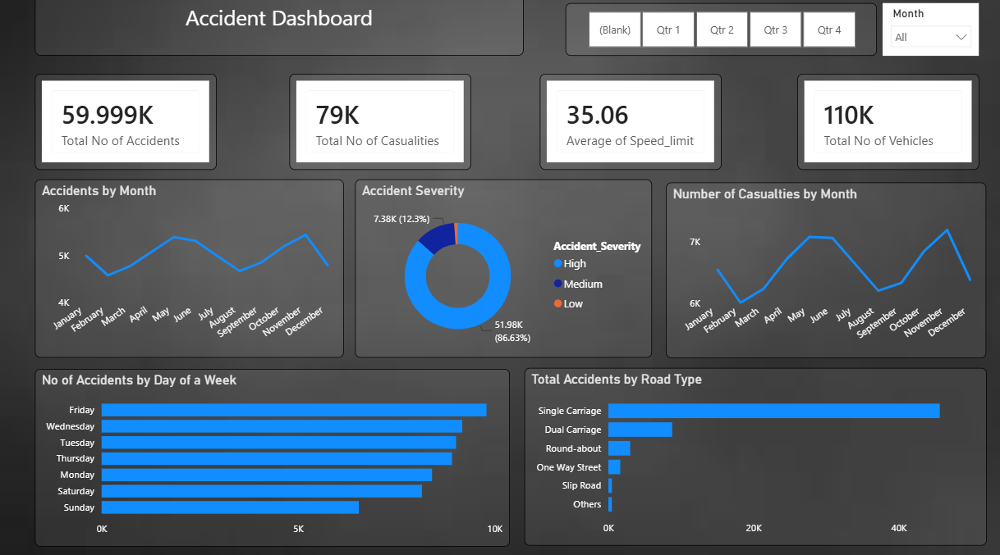

# Accident Data Analysis Dashboard | Power BI

## Project Overview
This project focuses on analyzing road accident data using Power BI to identify trends, patterns, and factors contributing to accidents and casualties. The dashboard was built using a dataset containing approximately 60,000 accident records and provides interactive visualizations to support data-driven decision-making and road safety initiatives.

The analysis covers accident frequency, casualty trends, accident severity, road types, and weekly and monthly accident patterns. :contentReference[oaicite:0]{index=0}

---

## Dashboard Preview



---

## Problem Statement
Road accidents lead to significant loss of life and property every year. Understanding when and where accidents occur can help authorities implement better traffic management strategies and improve road safety.

This dashboard aims to answer the following questions:

- How many accidents and casualties occurred?
- Which months experience the highest number of accidents?
- Which days of the week are most accident-prone?
- What is the distribution of accident severity?
- Which road types contribute the most to accidents?

---

## Dataset Information

- Dataset Size: Approximately 60,000 records
- Data Source: Road Accident Dataset (2018)
- File Format: CSV/Excel
- Number of Features: 20+ columns including:

  - Accident Date
  - Month
  - Quarter
  - Number of Casualties
  - Number of Vehicles
  - Speed Limit
  - Accident Severity
  - Road Type
  - Day of Week

---

## Tools and Technologies Used

- Power BI Desktop
- Power Query
- DAX (Data Analysis Expressions)
- Microsoft Excel
- Data Cleaning and Transformation Techniques

---

## Dashboard KPIs

| KPI | Value |
|------|--------|
| Total Accidents | 59.99K |
| Total Casualties | 79K |
| Total Vehicles Involved | 110K |
| Average Speed Limit | 35.06 km/hr |

---

## Dashboard Features

- Interactive Quarter and Month Slicers
- Dynamic KPI Cards
- Monthly Accident Trend Analysis
- Monthly Casualty Analysis
- Accident Severity Distribution
- Accidents by Day of Week
- Accidents by Road Type
- User-friendly and interactive dashboard design

---

## Key Findings

### Total Accidents and Casualties
- Approximately 60,000 accidents occurred during the year.
- Around 79,000 casualties were recorded.
- More than 110,000 vehicles were involved in accidents. :contentReference[oaicite:1]{index=1}

### Accident Severity
- High Severity: 51.98K (86.63%)
- Medium Severity: 7.38K (12.3%)
- Low Severity: Less than 1%

Most accidents were severe in nature, indicating a significant impact on human lives.

### Monthly Trends
- Highest accident counts were observed in:
  - May
  - June
  - November

- Lowest accident counts were observed in:
  - August
  - September

Casualties remained above 5,000 every month, showing a consistently high impact of road accidents throughout the year. :contentReference[oaicite:2]{index=2}

### Day-wise Analysis
- Friday recorded the highest number of accidents.
- Sunday recorded the lowest number of accidents.

A possible reason for higher accidents on Fridays could be increased travel activity, weekend outings, and rush-hour traffic. :contentReference[oaicite:3]{index=3}

### Road Type Analysis
- Single Carriageway roads contributed to the majority of accidents.
- Dual Carriageways recorded significantly fewer accidents.
- Roundabouts and Slip Roads contributed minimally.

### Speed Analysis
- The average speed limit across accident locations was approximately 35 km/hr. :contentReference[oaicite:4]{index=4}

---

## Business Insights

1. Fridays should receive additional traffic monitoring and law enforcement.
2. Road safety campaigns should be intensified before high-risk months such as May, June, and November.
3. Authorities should focus on improving safety measures on Single Carriageway roads.
4. Speed regulations and awareness campaigns can help reduce accident severity.
5. Accident-prone periods can be targeted for better traffic management and emergency preparedness.

---

## Future Enhancements

- Add geographical analysis using Power BI Maps.
- Include weather and location-based factors.
- Develop predictive models for accident forecasting.
- Create drill-through pages for deeper analysis.
- Integrate real-time accident datasets.

---

## Project Structure

```text
Accident-Data-Analysis/
│
├── Dataset/
│   └── Accident_Data.csv
│
├── Dashboard/
│   └── Accident_Dashboard.pbix
│
├── Images/
│   └── dashboard.png
│
└── README.md
```

---

## Skills Demonstrated

- Data Cleaning and Transformation
- Data Visualization
- Business Intelligence
- Dashboard Development
- DAX Measures and Calculations
- Exploratory Data Analysis (EDA)
- KPI Development
- Insight Generation and Reporting

---

## Author

**Kumar Sambhav**

B.Tech, Electronics and Communication Engineering  
Jaypee Institute of Information Technology, Noida

- GitHub: https://github.com/Sambhav1717
- LinkedIn: https://www.linkedin.com/in/kumar-sambhav17

---

If you found this project useful, consider giving the repository a star.
